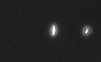
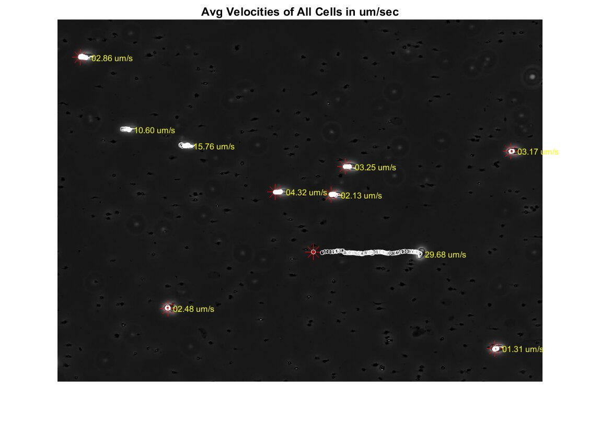

# rollingprofile

Analyzing video data for microfluidic adhesion experiments using image processing on MATLAB.  

The setup includes a microvasculature bed of Laminin (Ln) protein and sickle cell patients blood is flowed through the microchannels at ramping flow rates. Under flow conditions, the adhered cells experience forces of the order of 101-103 pN. The cells either directly detach or first roll down the bed (due to constant breaking and forming of protein-ligand bonds) and then detach. The cropped gif file of how the cells is shown below:

The algorithms developed as part of this work are capable of:
1. Identifying only the adhered cells using gradient thresholding. 
2. Tracking the position of centroids of each of the cells while accounting for cells that leave the frame during the video.
3. Analyzing the positions array of each of the cells to get motion measures like average velocity, fraction time of tumbling motion, and survival probability of individual cells  

The resulting rolling profile analysis looks like:

The white 

